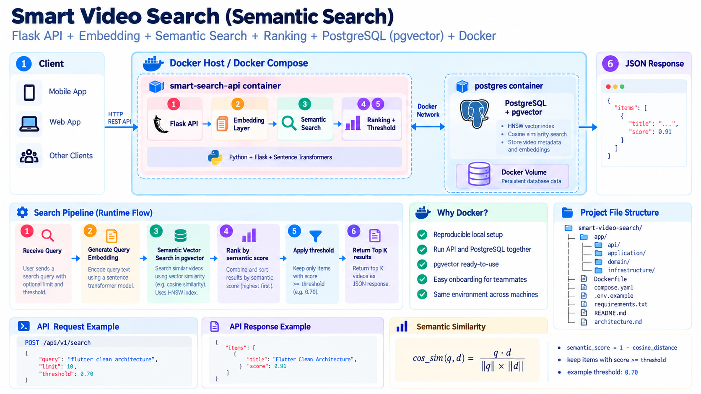

# Smart Video Search

Demo backend tìm kiếm video theo kiến trúc trong [architecture.md](architecture.md): Flask API, embedding, vector search, ranking, threshold filtering và Docker.



## Kiến trúc runtime

Luồng API đã kết nối PostgreSQL + pgvector thật:

```text
HTTP API
  -> application use case
  -> embedding provider
  -> PostgreSQL + pgvector repository
  -> ranking
  -> threshold
  -> JSON response
```

- Video metadata nằm trong bảng `videos`; vector nằm trong `video_embeddings` với `VECTOR(768)`.
- Truy vấn dùng cosine distance (`<=>`) và HNSW index `vector_cosine_ops`.
- Dữ liệu được giữ trong named volume `postgres_data` khi API hoặc database container restart.
- `HashingEmbeddingProvider` vẫn là adapter mặc định, nhẹ và không cần tải model. Nó phù hợp để kiểm tra luồng kỹ thuật; `SentenceTransformerEmbeddingProvider` có thể bật riêng khi cần semantic model thật.
- Adapter in-memory chỉ còn dùng cho unit/integration test không cần database.

## Chạy bằng Docker

Yêu cầu Docker Engine hoặc Docker Desktop có Compose v2.

```bash
docker compose up --build -d
docker compose ps
curl http://localhost:8000/health
```

Kết quả health check:

```json
{
  "embedding_dimension": 768,
  "embedding_provider": "hashing",
  "status": "ok",
  "storage": "postgresql+pgvector"
}
```

Compose khởi động hai service:

- `db`: `pgvector/pgvector:0.8.6-pg17-bookworm`, publish cổng `5432`.
- `api`: Gunicorn/Flask, chỉ khởi động sau khi database và schema healthy.

Migration [migrations/001_init.sql](migrations/001_init.sql) tự chạy khi volume PostgreSQL được tạo lần đầu.

Dừng ứng dụng:

```bash
docker compose down
```

Lệnh này giữ lại database volume. Chỉ dùng lệnh sau khi thực sự muốn xóa toàn bộ dữ liệu local:

```bash
docker compose down --volumes
```

Có thể đổi cổng host mà không sửa Compose:

```bash
API_PORT=8080 POSTGRES_PORT=5433 docker compose up --build -d
```

## Thử luồng index và search

Index một video:

```bash
curl -X POST http://localhost:8000/api/v1/videos/index \
  -H 'Content-Type: application/json' \
  -d '{
    "id": "ed41e827-bf98-4457-a083-f8ac87ebee80",
    "title": "Flutter Clean Architecture with Riverpod",
    "description": "Repository, DataSource and ViewModel architecture.",
    "tags": ["flutter", "riverpod", "architecture"]
  }'
```

Tìm kiếm:

```bash
curl -X POST http://localhost:8000/api/v1/search \
  -H 'Content-Type: application/json' \
  -d '{
    "query": "flutter architecture using riverpod",
    "limit": 10,
    "threshold": 0.1
  }'
```

Đọc metadata theo ID:

```bash
curl http://localhost:8000/api/v1/videos/ed41e827-bf98-4457-a083-f8ac87ebee80
```

## Chạy test

Với Python 3.12+:

```bash
python -m venv .venv
. .venv/bin/activate
pip install -r requirements-dev.txt
pytest
```

Chạy test đầy đủ với PostgreSQL + pgvector thật trong Compose:

```bash
docker compose --profile test run --rm integration-test
```

Test database xác nhận dữ liệu được đọc lại từ một application instance mới, thay vì vô tình dùng state trong memory.

## Sentence Transformers (tùy chọn)

Cài dependencies ML:

```bash
pip install -r requirements-ml.txt
```

Sau đó cấu hình, ví dụ:

```dotenv
EMBEDDING_PROVIDER=sentence_transformer
EMBEDDING_MODEL=intfloat/multilingual-e5-base
EMBEDDING_DIMENSION=768
```

Để build image kèm dependencies ML:

```bash
INSTALL_ML=true docker compose build
```

Model sẽ được tải ở lần khởi động đầu tiên. Cấu hình mặc định không bật chế độ này để image nhỏ và quá trình Docker smoke test có thể lặp lại nhanh. Model thay thế phải sinh đúng 768 chiều; đổi dimension yêu cầu migration cột vector và tạo lại HNSW index.

## API

| Method | Endpoint | Mục đích |
|---|---|---|
| `GET` | `/health` | Health check |
| `POST` | `/api/v1/videos/index` | Tạo/cập nhật video và embedding |
| `GET` | `/api/v1/videos/{video_id}` | Đọc video trong runtime hiện tại |
| `POST` | `/api/v1/search` | Vector search, ranking, threshold và top K |

Các biến cấu hình được mô tả trong [.env.example](.env.example). Giá trị user/password mặc định chỉ dành cho máy phát triển; hãy thay bằng secret phù hợp khi triển khai ra môi trường dùng chung.

Kiểm tra trực tiếp PostgreSQL:

```bash
docker compose exec db psql -U smart_search -d smart_search -c '\\dx vector'
docker compose exec db psql -U smart_search -d smart_search -c '\\d+ video_embeddings'
```
