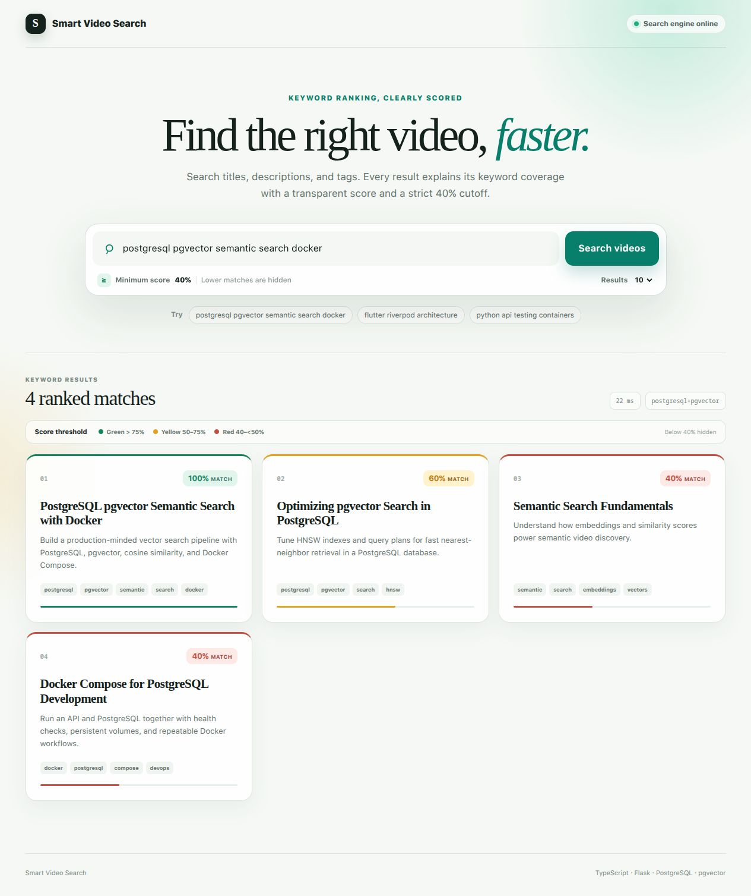

# Smart Video Search

A Docker-first video metadata search demo with a TypeScript web application, a Flask API, PostgreSQL, and pgvector. It supports transparent keyword ranking and semantic vector search over video titles, descriptions, and tags.



## What is included

- A responsive TypeScript search website built with React and Vinext.
- Keyword search with an explainable coverage score.
- Semantic search backed by PostgreSQL and pgvector.
- A Flask API organized around application, domain, and infrastructure layers.
- An idempotent Docker seed job that inserts 12 sample videos.
- PostgreSQL schema initialization, persistent storage, health checks, and integration tests.
- Environment-based configuration with local secrets kept out of Git.

The implementation follows the structure described in [architecture.md](architecture.md).


## Search scoring

Keyword mode extracts the unique words in the query and checks their coverage across each video's title, description, and tags:

```text
score = matched unique query terms / total unique query terms
```

The API enforces a minimum keyword score of `0.40`, even if a client submits a lower threshold. The website makes the same rule visible to users:

| Score | Website color | Result behavior |
|---:|---|---|
| `> 75%` | Green | Returned |
| `50%–75%` | Yellow | Returned |
| `40%–<50%` | Red | Returned |
| `< 40%` | — | Hidden |

The default demonstration query is:

```text
postgresql pgvector semantic search docker
```

It produces four seeded matches at `100%`, `60%`, `40%`, and `40%`.

## Runtime services

| Service | Purpose | Host port |
|---|---|---:|
| `web` | TypeScript search UI and API proxy | `3000` |
| `api` | Flask/Gunicorn REST API | `8000` |
| `db` | PostgreSQL 17 with pgvector | `5432` |
| `seed` | One-shot, idempotent dummy-data loader | — |

The startup order is database → seed job → API → website. Docker health checks prevent dependent services from starting too early.

## Environment configuration

The local `.env` file is ignored by Git and is read automatically by Docker Compose. The committed [.env.example](.env.example) intentionally contains field-name placeholders only, for example `APP_ENV=APP_ENV`, and no working credentials.

For a new checkout:

```bash
cp .env.example .env
```

Replace every placeholder in `.env` with the appropriate local or deployment value. Important fields include:

| Variable | Description |
|---|---|
| `APP_ENV` | Application environment name |
| `STORAGE_BACKEND` | Repository backend; use `postgres` for Docker |
| `POSTGRES_USER`, `POSTGRES_PASSWORD`, `POSTGRES_DB` | PostgreSQL connection settings |
| `DATABASE_URL` | Psycopg connection URL used inside the Docker network |
| `EMBEDDING_PROVIDER`, `EMBEDDING_MODEL`, `EMBEDDING_DIMENSION` | Embedding adapter configuration |
| `DEFAULT_SEARCH_THRESHOLD` | Default API threshold; keyword mode still enforces at least `0.40` |
| `API_PORT`, `WEB_PORT`, `POSTGRES_PORT` | Published host ports |
| `API_INTERNAL_URL` | API URL used by the website container |

Never commit `.env` or production credentials.

## Run with Docker

Docker Engine or Docker Desktop with Compose v2 is required.

```bash
docker compose up --build -d
docker compose ps -a
```

Open the website at [http://localhost:3000](http://localhost:3000). The API health endpoint is available at [http://localhost:8000/health](http://localhost:8000/health).

The seed service loads [data/dummy_videos.json](data/dummy_videos.json) with [scripts/seed_dummy_data.py](scripts/seed_dummy_data.py). Video IDs are fixed and database writes use upserts, so rerunning Compose does not create duplicate records.

Stop the application while retaining PostgreSQL data:

```bash
docker compose down
```

To intentionally remove the local database volume as well:

```bash
docker compose down --volumes
```

## Search API

### Keyword search

```bash
curl -X POST http://localhost:8000/api/v1/search \
  -H 'Content-Type: application/json' \
  -d '{
    "query": "postgresql pgvector semantic search docker",
    "mode": "keyword",
    "threshold": 0.40,
    "limit": 10
  }'
```

Each item contains a normalized `score`. The response also returns the effective `threshold`, which is never below `0.40` in keyword mode.

### Semantic search

```bash
curl -X POST http://localhost:8000/api/v1/search \
  -H 'Content-Type: application/json' \
  -d '{
    "query": "vector database tutorial",
    "mode": "semantic",
    "threshold": 0.40,
    "limit": 10
  }'
```

Semantic mode embeds the query, performs cosine-distance candidate search through pgvector, ranks the candidates, applies the requested threshold, and returns the top results.

### Index a video

```bash
curl -X POST http://localhost:8000/api/v1/videos/index \
  -H 'Content-Type: application/json' \
  -d '{
    "id": "ed41e827-bf98-4457-a083-f8ac87ebee80",
    "title": "Flutter Clean Architecture with Riverpod",
    "description": "Repository, DataSource and ViewModel architecture.",
    "tags": ["flutter", "riverpod", "architecture"]
  }'
```

### Endpoints

| Method | Endpoint | Purpose |
|---|---|---|
| `GET` | `/health` | Check API, embedding adapter, and storage health |
| `POST` | `/api/v1/search` | Run `keyword` or `semantic` search |
| `POST` | `/api/v1/videos/index` | Create or update a video and its embedding |
| `GET` | `/api/v1/videos/{video_id}` | Read a stored video by ID |

## Database

The first database startup applies [migrations/001_init.sql](migrations/001_init.sql). Metadata is stored in `videos`; 768-dimensional vectors are stored in `video_embeddings`. Semantic search uses cosine distance and an HNSW `vector_cosine_ops` index. The `postgres_data` named volume keeps data across container restarts.

Inspect the pgvector installation and table definition:

```bash
docker compose exec db sh -lc 'psql -U "$POSTGRES_USER" -d "$POSTGRES_DB" -c "\\dx vector"'
docker compose exec db sh -lc 'psql -U "$POSTGRES_USER" -d "$POSTGRES_DB" -c "\\d+ video_embeddings"'
```

## Tests and quality checks

Run the complete Python suite against a real PostgreSQL/pgvector container:

```bash
docker compose --profile test run --rm --build integration-test
```

Run the TypeScript checks locally from `web/`:

```bash
npm ci
npm run lint
npm run build
npm run build:node
```

The verified build currently passes 12 Python tests, TypeScript lint, the Vinext production build, Docker health checks, and a live browser smoke test.

## Optional sentence-transformer model

The default hashing embedding adapter keeps the Docker image small and deterministic for local development. To use a sentence-transformer model, install the ML dependencies and update `.env`:

```bash
pip install -r requirements-ml.txt
```

```dotenv
EMBEDDING_PROVIDER=sentence_transformer
EMBEDDING_MODEL=intfloat/multilingual-e5-base
EMBEDDING_DIMENSION=768
INSTALL_ML=true
```

Then rebuild the images:

```bash
docker compose build
docker compose up -d
```

The selected model must produce 768-dimensional vectors. Changing that dimension requires a database migration and rebuilding the HNSW index.
