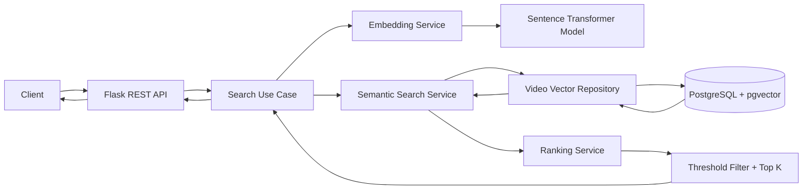

# Smart Video Semantic Search — Architecture

## 1. Goal

This document defines the architecture for a **demo-level Smart Search backend** focused only on:

- Flask REST API
- Text embedding generation
- Semantic vector search
- Ranking and threshold filtering
- PostgreSQL + pgvector

The system searches video metadata such as:

- `title`
- `description`
- optional `tags`

The demo intentionally excludes authentication, Redis, background workers, message queues, observability, recommendation systems, and other production infrastructure.

---

## 2. Scope

### In scope

1. Index a video into PostgreSQL.
2. Convert video text into an embedding vector.
3. Convert a user query into an embedding vector.
4. Search the nearest vectors using pgvector.
5. Calculate semantic similarity.
6. Rank candidates by score.
7. Remove results below a configured threshold.
8. Return the top matching videos through Flask API.

### Out of scope

- Authentication / authorization
- API gateway
- Redis
- Kafka / RabbitMQ
- Celery
- Elasticsearch / OpenSearch
- Hybrid keyword search
- Cross-encoder reranking
- Personalization
- Analytics
- Distributed microservices

These can be added later without changing the core domain contracts.

---

## 3. High-Level Architecture



### Important runtime detail

The logical layers are:

```text
API
  -> Application / Use Case
      -> Embedding
      -> Semantic Search
      -> Ranking
      -> Persistence
```

However, the **runtime search flow** must query PostgreSQL before final ranking because the ranking layer needs candidate results:

```text
Flask API
  -> Query Embedding
  -> pgvector Candidate Search
  -> Similarity Score
  -> Ranking
  -> Threshold Filter
  -> Top K
  -> API Response
```

---

## 4. Search Request Flow

Example request:

```http
POST /api/v1/search
Content-Type: application/json
```

```json
{
  "query": "flutter clean architecture with riverpod",
  "limit": 10,
  "threshold": 0.70
}
```

Detailed flow:

```text
1. Client sends search query
                |
                v
2. Flask validates request
                |
                v
3. SearchVideosUseCase receives SearchRequest
                |
                v
4. EmbeddingService converts query -> vector
                |
                v
5. SemanticSearchService asks repository for nearest vectors
                |
                v
6. PostgreSQL + pgvector executes cosine-distance search
                |
                v
7. Repository returns candidate videos + similarity scores
                |
                v
8. RankingService sorts candidates by score
                |
                v
9. ThresholdPolicy removes weak matches
                |
                v
10. Top K results are returned to Flask
                |
                v
11. Flask returns JSON response
```

---

## 5. Project Structure

```text
smart-search-api/
├── app/
│   ├── __init__.py
│   ├── app_factory.py
│   │
│   ├── api/
│   │   └── v1/
│   │       ├── __init__.py
│   │       ├── search_routes.py
│   │       ├── video_routes.py
│   │       └── schemas.py
│   │
│   ├── application/
│   │   ├── __init__.py
│   │   ├── search_videos.py
│   │   ├── index_video.py
│   │   └── dto.py
│   │
│   ├── domain/
│   │   ├── __init__.py
│   │   ├── entities/
│   │   │   ├── video.py
│   │   │   └── search_result.py
│   │   ├── services/
│   │   │   ├── ranking_service.py
│   │   │   └── threshold_policy.py
│   │   └── ports/
│   │       ├── embedding_provider.py
│   │       └── video_search_repository.py
│   │
│   ├── infrastructure/
│   │   ├── __init__.py
│   │   ├── embedding/
│   │   │   └── sentence_transformer_provider.py
│   │   └── database/
│   │       ├── db.py
│   │       ├── models.py
│   │       └── pgvector_video_repository.py
│   │
│   └── config/
│       └── settings.py
│
├── migrations/
├── tests/
│   ├── unit/
│   │   ├── test_ranking_service.py
│   │   └── test_threshold_policy.py
│   └── integration/
│       ├── test_search_api.py
│       └── test_pgvector_repository.py
│
├── architecture.md
├── requirements.txt
├── Dockerfile
├── docker-compose.yml
└── .env.example
```

---

## 6. Layer Responsibilities

## 6.1 API Layer

Location:

```text
app/api/v1/
```

Responsibilities:

- expose HTTP endpoints
- validate input
- convert HTTP request into application DTO
- call application use cases
- map application result into JSON
- convert known exceptions into HTTP status codes

The API layer must **not**:

- generate embeddings directly
- execute SQL
- calculate ranking rules
- know pgvector implementation details

Example endpoints:

```text
POST /api/v1/search
POST /api/v1/videos/index
GET  /api/v1/videos/{video_id}
```

Example controller flow:

```python
@bp.post("/search")
def search():
    payload = SearchRequestSchema.model_validate(request.json)

    result = search_videos.execute(
        query=payload.query,
        limit=payload.limit,
        threshold=payload.threshold,
    )

    return SearchResponseSchema.from_domain(result).model_dump()
```

---

## 6.2 Application Layer

Location:

```text
app/application/
```

The application layer orchestrates the use case.

Main use cases:

```text
SearchVideosUseCase
IndexVideoUseCase
```

`SearchVideosUseCase` coordinates:

```text
EmbeddingProvider
       |
       v
VideoSearchRepository
       |
       v
RankingService
       |
       v
ThresholdPolicy
```

Pseudo-code:

```python
class SearchVideosUseCase:

    def execute(
        self,
        query: str,
        limit: int,
        threshold: float,
    ) -> list[SearchResult]:

        query_vector = self.embedding_provider.embed_query(query)

        candidates = self.repository.semantic_search(
            query_vector=query_vector,
            candidate_limit=max(limit * 5, 50),
        )

        ranked = self.ranking_service.rank(candidates)

        filtered = self.threshold_policy.apply(
            ranked,
            threshold=threshold,
        )

        return filtered[:limit]
```

The application layer contains orchestration, not infrastructure details.

---

## 6.3 Embedding Layer

Interface:

```text
app/domain/ports/embedding_provider.py
```

Implementation:

```text
app/infrastructure/embedding/sentence_transformer_provider.py
```

Contract:

```python
from typing import Protocol

class EmbeddingProvider(Protocol):

    def embed_query(self, text: str) -> list[float]:
        ...

    def embed_document(self, text: str) -> list[float]:
        ...
```

Infrastructure implementation:

```python
class SentenceTransformerEmbeddingProvider:

    def __init__(self, model):
        self.model = model

    def embed_query(self, text: str) -> list[float]:
        normalized = normalize_query(text)

        vector = self.model.encode(
            normalized,
            normalize_embeddings=True,
        )

        return vector.tolist()
```

For retrieval-oriented models, keep query/document encoding rules isolated here.

Example models:

```text
intfloat/multilingual-e5-base
BAAI/bge-m3
```

The rest of the application must not depend on a specific model.

---

## 7. Video Text Used for Embedding

For the demo, create one searchable document per video.

Recommended format:

```text
title: {video.title}
description: {video.description}
tags: {comma_separated_tags}
```

Example:

```text
title: Flutter Clean Architecture with Riverpod
description: How to organize repositories, data sources and view models in Flutter.
tags: flutter, riverpod, clean architecture
```

This complete text is converted into one vector.

This keeps the first version simple:

```text
1 video
    ->
1 searchable text document
    ->
1 embedding vector
```

Later, title and description can be indexed separately if field-level weighting becomes necessary.

---

## 8. Semantic Search Layer

Main abstraction:

```text
VideoSearchRepository
```

Contract:

```python
class VideoSearchRepository(Protocol):

    def semantic_search(
        self,
        query_vector: list[float],
        candidate_limit: int,
    ) -> list[SearchCandidate]:
        ...
```

`SearchCandidate`:

```python
@dataclass(frozen=True)
class SearchCandidate:
    video_id: UUID
    title: str
    description: str
    cosine_distance: float
    semantic_score: float
```

Infrastructure implementation:

```text
PgVectorVideoRepository
```

The semantic search service should not construct raw SQL inside the Flask controller.

---

## 9. PostgreSQL + pgvector

Recommended tables:

```sql
CREATE EXTENSION IF NOT EXISTS vector;

CREATE TABLE videos (
    id UUID PRIMARY KEY,
    title TEXT NOT NULL,
    description TEXT,
    tags TEXT[],
    created_at TIMESTAMPTZ NOT NULL DEFAULT NOW(),
    updated_at TIMESTAMPTZ NOT NULL DEFAULT NOW()
);

CREATE TABLE video_embeddings (
    video_id UUID PRIMARY KEY
        REFERENCES videos(id)
        ON DELETE CASCADE,

    embedding VECTOR(768) NOT NULL,

    model_name TEXT NOT NULL,
    content_hash TEXT,
    updated_at TIMESTAMPTZ NOT NULL DEFAULT NOW()
);
```

`VECTOR(768)` is only an example.

The vector dimension must match the selected embedding model.

For example:

```text
multilingual-e5-base -> 768 dimensions
```

---

## 10. HNSW Index

For approximate nearest-neighbor search:

```sql
CREATE INDEX video_embeddings_hnsw_idx
ON video_embeddings
USING hnsw (embedding vector_cosine_ops);
```

This allows fast cosine-distance retrieval.

For a very small demo dataset, exact vector search also works without HNSW.

---

## 11. pgvector Search Query

Example:

```sql
SELECT
    v.id,
    v.title,
    v.description,
    ve.embedding <=> CAST(:query_embedding AS vector) AS cosine_distance,
    1 - (
        ve.embedding <=> CAST(:query_embedding AS vector)
    ) AS semantic_score
FROM video_embeddings ve
JOIN videos v
    ON v.id = ve.video_id
ORDER BY ve.embedding <=> CAST(:query_embedding AS vector)
LIMIT :candidate_limit;
```

With cosine distance:

```text
distance = embedding <=> query_embedding
```

Convert it into similarity:

```text
semantic_score = 1 - cosine_distance
```

Higher `semantic_score` means a stronger match.

---

## 12. Similarity Formula

Cosine similarity:

\[
\text{cosineSimilarity}(q,d)
=
\frac{q \cdot d}
{\|q\|\|d\|}
\]

Where:

```text
q = query embedding
d = video document embedding
```

If vectors are normalized:

```text
cosine similarity ~= dot product
```

For application-level readability:

```text
semantic_score = 1 - cosine_distance
```

Example:

```text
Query:
"flutter architecture using riverpod"

Candidate A:
"Flutter Clean Architecture with Riverpod"
semantic_score = 0.91

Candidate B:
"Android Compose Architecture"
semantic_score = 0.69

Candidate C:
"How to Cook Beef Pho"
semantic_score = 0.12
```

---

## 13. Ranking Layer

Location:

```text
app/domain/services/ranking_service.py
```

For the demo, ranking is intentionally simple and deterministic.

```python
class RankingService:

    def rank(
        self,
        candidates: list[SearchCandidate],
    ) -> list[SearchCandidate]:

        return sorted(
            candidates,
            key=lambda item: item.semantic_score,
            reverse=True,
        )
```

Ranking formula:

\[
FinalScore = SemanticScore
\]

This is enough for a pure semantic-search demo.

The design deliberately keeps ranking in a separate service so a later version can support:

```text
FinalScore =
    w1 * semantic_score
  + w2 * keyword_score
  + w3 * freshness_score
  + w4 * popularity_score
```

without changing API or persistence contracts.

---

## 14. Threshold Filtering

Location:

```text
app/domain/services/threshold_policy.py
```

Example:

```python
class ThresholdPolicy:

    def apply(
        self,
        candidates: list[SearchCandidate],
        threshold: float,
    ) -> list[SearchCandidate]:

        return [
            item
            for item in candidates
            if item.semantic_score >= threshold
        ]
```

Example configuration:

```text
DEFAULT_SEARCH_THRESHOLD=0.70
```

Conceptual interpretation:

```text
0.85 - 1.00 -> very strong semantic match
0.75 - 0.85 -> strong match
0.65 - 0.75 -> possible match
< 0.65      -> usually filtered
```

These numbers are **not universal**.

The final threshold must be calibrated using real query/video examples for the selected embedding model.

---

## 15. Candidate Limit vs Result Limit

Do not ask pgvector for only the final number of results.

Example:

```text
requested result limit = 10
candidate limit        = 50
```

Flow:

```text
pgvector
   |
   | top 50 nearest candidates
   v
Ranking
   |
   v
Threshold filter
   |
   v
Top 10 final results
```

Reason:

A threshold can remove candidates.

If PostgreSQL returns only 10 candidates, the API may end with only 3 useful results even when more relevant candidates exist slightly lower in the nearest-neighbor list.

Recommended demo rule:

```python
candidate_limit = max(limit * 5, 50)
```

---

## 16. Index Video Flow

The demo needs a minimal indexing operation so vectors exist before searching.

```text
POST /api/v1/videos/index
          |
          v
IndexVideoUseCase
          |
          +--> save/update video metadata
          |
          +--> build searchable document
          |
          +--> EmbeddingProvider.embed_document(...)
          |
          +--> save embedding into PostgreSQL
```

Example request:

```json
{
  "id": "ed41e827-bf98-4457-a083-f8ac87ebee80",
  "title": "Flutter Clean Architecture with Riverpod",
  "description": "Repository, DataSource and ViewModel architecture.",
  "tags": [
    "flutter",
    "riverpod",
    "architecture"
  ]
}
```

---

## 17. Search API Contract

Request:

```http
POST /api/v1/search
```

```json
{
  "query": "how to structure flutter application",
  "limit": 10,
  "threshold": 0.70
}
```

Response:

```json
{
  "query": "how to structure flutter application",
  "threshold": 0.70,
  "count": 2,
  "items": [
    {
      "id": "ed41e827-bf98-4457-a083-f8ac87ebee80",
      "title": "Flutter Clean Architecture with Riverpod",
      "description": "Repository, DataSource and ViewModel architecture.",
      "score": 0.9124
    },
    {
      "id": "fcd2041f-6b5d-465f-8efd-23ba75b11513",
      "title": "Repository Pattern in Flutter",
      "description": "Organizing API and database access using repositories.",
      "score": 0.8421
    }
  ]
}
```

If nothing reaches the threshold:

```json
{
  "query": "how to structure flutter application",
  "threshold": 0.90,
  "count": 0,
  "items": []
}
```

---

## 18. Dependency Direction

The most important architecture rule is:

```text
outer layers depend on inner contracts
```

Not:

```text
domain -> SQLAlchemy
domain -> Flask
domain -> SentenceTransformer
```

Correct dependency direction:

```text
Flask API
   |
   v
Application
   |
   v
Domain Interfaces
   ^
   |
Infrastructure Adapters
```

Example:

```text
EmbeddingProvider              <- interface
    ^
    |
SentenceTransformerProvider    <- implementation
```

```text
VideoSearchRepository          <- interface
    ^
    |
PgVectorVideoRepository        <- implementation
```

This keeps business logic testable and allows infrastructure replacement.

---

## 19. Object Dependency Graph

At application startup:

```text
SentenceTransformerEmbeddingProvider
                 |
                 v
          EmbeddingProvider


Postgres / SQLAlchemy
        |
        v
PgVectorVideoRepository
        |
        v
VideoSearchRepository


EmbeddingProvider -----------+
                            |
VideoSearchRepository -------+--> SearchVideosUseCase
                            |
RankingService --------------+
                            |
ThresholdPolicy -------------+
```

The Flask route receives only:

```text
SearchVideosUseCase
```

It does not need to know which embedding model or database implementation is used.

---

## 20. Configuration

Example `.env`:

```dotenv
APP_ENV=development

DATABASE_URL=postgresql+psycopg://postgres:postgres@db:5432/smart_search

EMBEDDING_MODEL=intfloat/multilingual-e5-base
EMBEDDING_DIMENSION=768

DEFAULT_SEARCH_THRESHOLD=0.70
DEFAULT_SEARCH_LIMIT=10
MAX_SEARCH_LIMIT=50
SEARCH_CANDIDATE_MULTIPLIER=5
```

`settings.py` is the only place that should read environment variables directly.

---

## 21. Minimal Dependencies

Example `requirements.txt`:

```text
Flask
pydantic
SQLAlchemy
psycopg[binary]
pgvector
sentence-transformers
numpy
gunicorn
```

For local development:

```text
pytest
pytest-cov
```

---

## 22. Minimum Tests for the Demo

### Unit tests

```text
test_ranking_service.py
    - results sorted descending
    - equal scores handled consistently

test_threshold_policy.py
    - score above threshold is kept
    - score below threshold is removed
    - threshold boundary is accepted
```

### Integration tests

```text
test_pgvector_repository.py
    - insert embedding
    - nearest vectors returned correctly
    - result includes semantic_score

test_search_api.py
    - valid search returns 200
    - invalid query returns 400
    - no matching result returns empty items
```

---

## 23. Recommended Implementation Order

```text
Step 1
Create Flask application factory

Step 2
Create PostgreSQL + pgvector using Docker Compose

Step 3
Create videos and video_embeddings tables

Step 4
Implement EmbeddingProvider

Step 5
Implement PgVectorVideoRepository

Step 6
Implement IndexVideoUseCase

Step 7
Implement RankingService and ThresholdPolicy

Step 8
Implement SearchVideosUseCase

Step 9
Expose POST /api/v1/search

Step 10
Create a small evaluation dataset and tune threshold
```

---

## 24. Final Demo Architecture

```text
                         SMART SEARCH DEMO

┌──────────────────────────────────────────────────────────────┐
│                         Flask API                            │
│                                                              │
│  POST /api/v1/search       POST /api/v1/videos/index        │
└──────────────────────────────┬───────────────────────────────┘
                               │
                               v
┌──────────────────────────────────────────────────────────────┐
│                     Application Use Cases                    │
│                                                              │
│       SearchVideosUseCase          IndexVideoUseCase         │
└───────────────┬───────────────────────────┬──────────────────┘
                │                           │
                v                           v
┌──────────────────────────┐     ┌─────────────────────────────┐
│    Embedding Provider    │     │       Ranking Domain        │
│                          │     │                             │
│ Sentence Transformer     │     │ RankingService              │
│ query -> vector          │     │ ThresholdPolicy             │
│ document -> vector       │     │ Top K                       │
└─────────────┬────────────┘     └──────────────┬──────────────┘
              │                                 ^
              │                                 │ candidates
              v                                 │
┌──────────────────────────────────────────────────────────────┐
│                    Semantic Search Layer                     │
│                                                              │
│               VideoSearchRepository                         │
│                    semantic_search()                         │
└──────────────────────────────┬───────────────────────────────┘
                               │
                               v
┌──────────────────────────────────────────────────────────────┐
│                  PostgreSQL + pgvector                       │
│                                                              │
│    videos                     video_embeddings               │
│    ------                     ----------------               │
│    id                         video_id                       │
│    title                      embedding VECTOR(768)          │
│    description                model_name                     │
│    tags                       content_hash                   │
│                                                              │
│                  HNSW / cosine search                        │
└──────────────────────────────────────────────────────────────┘
```

---

## 25. Core Rule to Remember

The search feature can be summarized as:

```text
Query
  -> Embedding
  -> Vector Retrieval
  -> Similarity Score
  -> Ranking
  -> Threshold
  -> Top K
```

and the indexing path as:

```text
Video title + description + tags
  -> Document text
  -> Embedding
  -> PostgreSQL / pgvector
```

That is enough for a clean and realistic semantic-search demo while preserving a structure that can evolve into a production search platform later.
